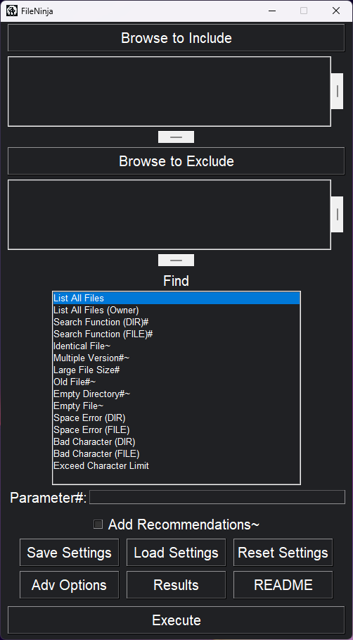
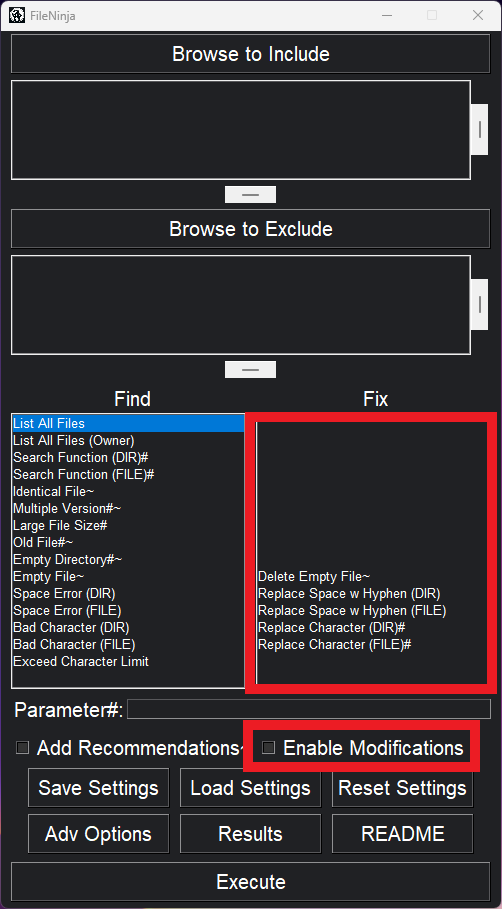

# FileNinja
FileNinja automates information management tasks that are not feasibly done manually, then outputs the results in an Excel workbook. The Admin version includes everything from the Lite version, plus more features.

  
  

Fig.1 & Fig.2: Lite GUI vs Admin GUI.

 
 

  

Fig.3: Advanced Options window.

# Explanation of Basic Elements
## Lite Features
| Element | Description |
|---|---|
| Browse to Select | Select the directory to perform procedures on. |
| Browse to Exclude | Select subdirectories of the main directory to exclude from the scope. Hidden directories — and their subdirectories (hidden or not) — are excluded by default. To unexclude a directory, either double-click or right click it. If `Include Subdirectories` is disabled, this feature does nothing. |
| Find procedures | Click the desired procedures to run. Each procedure outputs its own sheet in the workbook. |
| Parameter# | Procedures that end in `#` require an argument. Input their arguments here. If running multiple procedures, separate arguments using `/`, in order from top to bottom of the list of procedures selected. Other than the search functions, all Find procedures have a default value. To use its default value, either input nothing in the parameter field, or separate by slashes and leave its value blank. **Example 1:** If running `Search Function (FILE)#` and `Multiple Version#~`, you may input `thingToSearch / 90`. **Example 2:** If running `Search Function (DIR)#`, `Old File#~`, and `Empty Directory#~`, you may input `thingToSearch * thingToSearch2 / /`. This will use the latter two procedures' default values. |
| Add Recommendations~ | If enabled, procedures that end in `~` will also display recommendations, indicated by color coding. Read the `Legend` sheet in the workbook to learn more. |
| Advanced Options | Open a window containing more options. |
| Include Subdirectories | If enabled, it will peruse through the main directory as well as all of its subdirectories. Otherwise, it will only traverse the currently selected directory. Related to `Browse to Exclude`. |
| Include Hidden Files | If enabled, Find procedures will include hidden files. **NOTE (ADMIN):** Fix procedures will always ignore hidden files. |
| Extensions to Exclude | Specify a comma separated list of extensions to exclude from scope. **DEFAULT:** `.shp, .dbf, .shx, .sbd, .sbx, .spx, .sbn, .qpj, .atx, .cpg, .prj, .gbd, .gdbtablx, .gdbtable, .freelist, .horizon, .gdbindexes, .one, .onepkg, .onetoc2, .onebak,` |
| Save Settings | Save current settings to a JSON file. After saving settings, the user is asked if they would like to create a corresponding batch file. Execute these batch files to automatically run FileNinja with the corresponding settings, bypassing the GUI. **NOTE (ADMIN):** `Enable Modifications` will always be saved as False. |
| Load Settings | Load settings from a JSON file. |
| Results | Open results directory, containing Excel files of previous executions. File names follow the format `<<SelectedDirectoryName>>-<<YY-mm-DD-HH-MM-SS>>.xlsx`. |
| Execute | Commence execution. |

## Admin Features
| Element | Description |
|---|---|
| Fix procedures | If `Enable Modifications` is disabled, it flags any errant files based on the selection, showing would-be fixes. If `Enable Modifications` is enabled, it executes said fixes. |
| Enable Modifications | If enabled, it executes all changes irreversibly. Cannot run multiple modifier Fix procedures simultaneously. |

# Find Procedures
| Name | Description |
|---|---|
| List All Files | Lists all files. |
| List All Files (Owner) | Lists all files. Includes an owner column and a last modified column. Owner is displayed in the format `<<DOMAIN>>\<<NAME>> (<<SID_TYPE>>)`. |
| Search Function (DIR)# | Same as file version, except for directory names. |
| Search Function (FILE)# | Runs a case-sensitive search for files that display either of the terms specified in the argument. Separate terms with a `*`. **Example 1:** With the argument set to `park * PARK`, any files that include either of those terms will display. |
| Identical File~ | Flags duplicate files. Error count is incremented for each duplicate found. (Includes owner and last modified columns.) **Example 1:** if a group of 5 identical files are found, the error count is incremented by 4. |
| Multiple Version#~ | Flags files of similar names. Ignores casing and file extensions when making comparisons. Accepts a "similarity measure" threshold as argument, set between 1.0% and 100.0%. **DEFAULT:** `98` **Example 1:** With the argument set to `90`, only filenames that are determined to be at least 90% similar get flagged. **Example 2:** With the argument set to `100`, only filenames that are determined to be at least 100% similar get flagged. |
| Large File Size# | Details a summary of each file extension found, as well as listing all items and their respective sizes, grouped by extension. **DEFAULT:** `100` (MB). (Only applies when `Add Recommendations~` is enabled.) |
| Old File#~ | Flags any file that has not been accessed in a specified number of days. (Includes owner and last modified columns.) **DEFAULT:** `1095` (i.e. 3 years). **NOTE:** Windows has a glitch regarding the "last accessed" attribute for a file, in that a file may be considered accessed even if it was not explicitly opened. Therefore, run this Find procedure first and foremost before perusing through your files. |
| Empty Directory#~ | Flags any directory that holds 0 folders and 0 files within. If an argument over 0 is specified, also flags and directories that hold 0 folders and <argument> files or less within. **DEFAULT:** `0`. |
| Empty File~ | Flags any file that is 0 bytes in size. (Includes owner and last modified columns.) **NOTE:** Some file types may be empty but are not 0 bytes, such as most Microsoft files. For instance, an empty Excel file is still roughly 6KB in size. |
| Space Error (DIR) | Flags directory names with spaces. |
| Space Error (FILE) | Flags file names with spaces. |
| Bad Character (DIR) | Flags directory names with bad characters. A bad character is any character that is either not alphanumeric, not a hyphen (-), or is a double hyphen (--). |
| Bad Character (FILE) | Flags file names with bad characters. A bad character is any character that is either not alphanumeric, not a hyphen (-), or is a double hyphen (--). |
| Exceed Character Limit | Flags file paths over 200 characters. These files are not backed up. |

# Fix Procedures
| Name | Description |
|---|---|
| Delete Empty File~ | Deletes any file that is 0 bytes in size. Read `Empty File~`'s description for more information. (Includes owner and last modified columns.) |
| Replace Space w Hyphen (DIR) | Same as the file version, except for directory names. |
| Replace Space w Hyphen (FILE) | Replaces all instances of spaces within file names with a hyphen and fixes bad hyphen usage. **Example 1:** "Engagement Tracker.txt" -> "Engagement-Tracker.txt". **Example 2:** "- Engagement - - Tracker -.txt" -> "Engagement-Tracker.txt". **Example 3:** "Engagement--Tracker.txt" -> "Engagement-Tracker.txt". |
| Replace Character (DIR)# | Same as the file version, except for directory names. |
| Replace Character (FILE)# | For file names, replaces substring with another substring, using a `>` as separator between the replacer and replace pair, and `*` as a separator between pairs. **NOTE:** If running multiple pairs of arguments, one pair's replacer can undo the work of an earlier pair's replacee (not a typo); order can matter if not careful. Always double-check your output if unsure. **Example 1:** With the argument set to `& > -and-`, all instances of `&` will be replaced with `-and-`. **Example 2:** With the argument set to `@>-at- * &-and-`, all instances of `@` will become `-at-`, and all instances of `&` will become `-and-`. |

# Interpreting the Output
## Summary sheet
The first sheet will always be the `Summary` sheet. The first 8 rows contain the selected settings. Rows 10-14 contain various metrics regarding the execution. Rows 16 and onward contain the count for each procedure selected.
 

  

Fig.4: Summary sheet.

## Legend sheet
If `Add Recommendations~` is enabled, a `Legend` sheet will be included in the output.
 

  

Fig.5: Legend sheet.

## Procedure sheets
The output of most procedure sheets will either be in the `Tree` or `Flat` format.
### Tree
Directories are in column A, with all applicable files under it displayed in the column B. Each directory is displayed only once.
 

  

Fig.6: Example of the tree format using the "List All Files (Owner)" procedure.

### Flat
Files are in column B, with their corresponding directories in column C. Each directory may be displayed more than once.
 

  

Fig.7: Example of the flat format using the "Identical File" procedure.

# Hints
## Scheduling Executions with Task Scheduler
**NOTE:** Ensure the .exe file exists, not just the .p7m file.
- Open `Task Scheduler`.
- Select `Create Basic Task...`.
- Create a name.
- Specify a trigger.
    - Specify trigger details further if applicable. These can always be changed later.
- Select `Start a program`.
- Specify program details.
    - `Program/script` = `<<Name-Of-Your-Exe>>.exe`
    - `Add arguments` = The location of the JSON settings you want to run. (ex: "C:\\Users\\FirstName LastName\\routineRunSettings.json"). **MUST** be in quotes.
    - `Start in` = The directory in which `<<Name-Of-Your-Exe>>.exe` resides. (ex: C:\\Users\\FirstName LastName\\). Must **NOT** be in quotes.
- Press finish.
- Right-click the newly created task, then press `Run` to ensure you set your program details correctly.

## Miscellaneous
- Hover your mouse over GUI elements for a short tooltip.
- Middle-click anywhere in the window to alternate between light and dark mode.
- `ctrl+w` to close the window.

